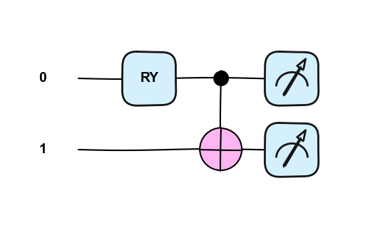
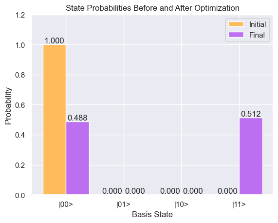
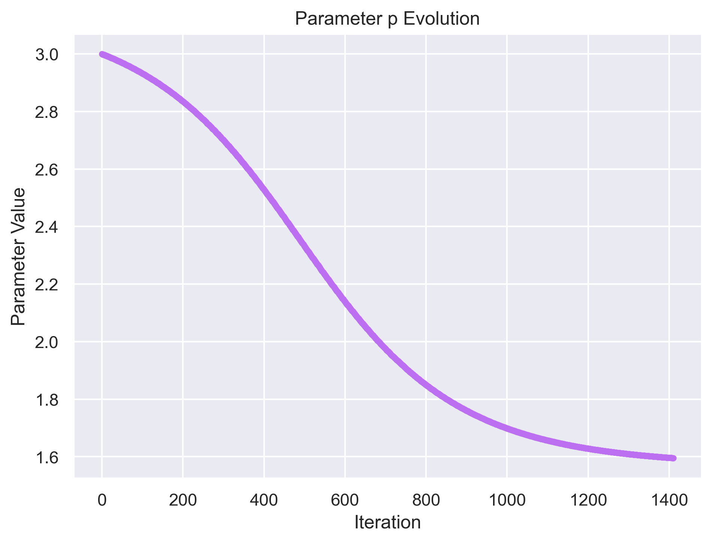

# Bell State Preparation via Variational Quantum Circuit
Preparing the Bell state |Φ+⟩ = (|00⟩ + |11⟩)/√2 using a single-parameter
variational quantum circuit, optimised with a hand-implemented parameter-shift rule.

Built with [PennyLane](https://pennylane.ai/).

---
> ⚠️ **Note:** figures may not render correctly on GitHub — they are visible in the notebook directly. ⚠️

## What this does

A variational circuit consisting of an RY rotation followed by a CNOT gate
is trained to produce equal-weight superposition across |00⟩ and |11⟩.
The cost function minimises the expectation values ⟨Z₀⟩² + (⟨Z₀Z₁⟩ − 1)²,
driving the system toward the target entangled state.

Optimisation uses gradient descent with the **parameter-shift rule** — a
hardware-compatible method that estimates gradients using only circuit
evaluations at shifted parameters (p ± π/2), without accessing internal quantum state.
This makes the approach directly transferable to real hardware.

---

## Circuit

RY is drawn from a universal gate set {RX, RY, CNOT} adopted for this project —
sufficient for arbitrary single- and two-qubit operations.

```
RY(p) ──●──
        │
   I ───⊕──
```


 
---
 
## Results
 
At the optimal parameter, the circuit produces |00⟩ and |11⟩ with equal
probability (~0.5 each), confirming successful Bell state preparation.
 
| Observable | Initial (p = 3.0) | Optimised |
|---|---|---|
| P(\|00⟩) | ~0.98 | ~0.50 |
| P(\|11⟩) | ~0.01 | ~0.50 |
 



---

## Project structure

```
bell-state-vqc/
├── bell_state_vqc.ipynb   # main notebook
├── figures/               # plots saved by the notebook
│   ├── circuit_diagram.png
│   ├── state_probabilities.png
│   └── parameter_evolution.png
├── requirements.txt
└── README.md
```

---

## Run it

```bash
pip install -r requirements.txt
jupyter notebook bell_state_vqc.ipynb
```

## Requirements

```
pennylane
numpy
matplotlib
seaborn
```

---

## Notes

Code written independently as part of self-directed study into variational
quantum algorithms. README and inline comments were refined with AI assistance
for clarity.
